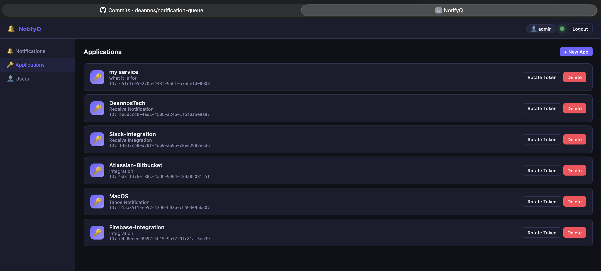

# NotifyQ

Send notifications from any service via a simple HTTP API and receive them in real time through WebSockets or the built-in web dashboard.

## Features

- **REST API** — send, list, delete, and mark notifications as read
- **Real-time push** — WebSocket stream delivers notifications instantly to connected clients
- **App tokens** — each application gets an independent token for sending notifications
- **JWT authentication** — secure user sessions with configurable expiry
- **Multi-user** — admin panel for managing users
- **Web dashboard** — built-in single-page UI (embedded in the binary)
- **SQLite backend** — zero external dependencies, single binary deployment
- **Docker ready** — includes a production Dockerfile




## Quick Start

### Prerequisites

- Go 1.23+ with CGO enabled (requires `gcc` for SQLite)
- Or use Docker (no local toolchain needed)

### Run locally

```bash
git clone https://github.com/deannos/notification-queue.git
cd notification-queue

# Copy and edit config
cp .env.example .env

make run
```

Open [http://localhost:8080](http://localhost:8080) and log in with the default credentials:

| Username | Password |
| -------- | -------- |
| `admin`  | `admin`  |

> **Change the default password** and set a strong `JWT_SECRET` before exposing to the internet.

### Docker

```bash
docker build -t notifyq .

docker run -d \
  -p 8080:8080 \
  -v notifyq-data:/data \
  -e JWT_SECRET=your-secret-here \
  -e DEFAULT_ADMIN_PASS=strongpassword \
  --name notifyq \
  notifyq
```

## Configuration

All settings are provided via environment variables:

| Variable             | Default            | Description                         |
| -------------------- | ------------------ | ----------------------------------- |
| `LISTEN_ADDR`        | `:8080`            | Address and port to listen on       |
| `DATABASE_PATH`      | `notifications.db` | Path to the SQLite database file    |
| `JWT_SECRET`         | `change-me-...`    | Secret used to sign JWT tokens      |
| `JWT_EXPIRY_HOURS`   | `24`               | Token validity in hours             |
| `DEFAULT_ADMIN_USER` | `admin`            | Admin username created on first run |
| `DEFAULT_ADMIN_PASS` | `admin`            | Admin password created on first run |
| `ALLOW_REGISTRATION` | `true`             | Allow public self-registration      |

## API Reference

### Authentication

**Login**

```http
POST /auth/login
Content-Type: application/json

{"username": "admin", "password": "admin"}
```

Returns a JWT token. Include it as `Authorization: Bearer <token>` in subsequent requests.

**Register**

```http
POST /auth/register
Content-Type: application/json

{"username": "myuser", "password": "mypassword"}
```

---

### Sending Notifications

Create an application in the dashboard to get an app token, then:

```http
POST /message
X-App-Token: <your-app-token>
Content-Type: application/json

{
  "title": "Deploy successful",
  "message": "v1.2.3 is live on production",
  "priority": 7
}
```

**Priority scale:** `1` (low) → `10` (critical)

**curl example:**

```bash
curl -X POST http://localhost:8080/message \
  -H "X-App-Token: your-app-token" \
  -H "Content-Type: application/json" \
  -d '{"title":"Hello","message":"World","priority":5}'
```

---

### Notifications

| Method   | Endpoint                        | Description                               |
| -------- | ------------------------------- | ----------------------------------------- |
| `GET`    | `/api/v1/notification`          | List notifications (`?limit=20&offset=0`) |
| `GET`    | `/api/v1/notification/:id`      | Get a single notification                 |
| `PUT`    | `/api/v1/notification/:id/read` | Mark as read                              |
| `DELETE` | `/api/v1/notification/:id`      | Delete a notification                     |
| `DELETE` | `/api/v1/notification`          | Delete all notifications                  |

### Applications

| Method   | Endpoint                        | Description                                |
| -------- | ------------------------------- | ------------------------------------------ |
| `GET`    | `/api/v1/application`           | List your applications                     |
| `POST`   | `/api/v1/application`           | Create an application (returns token once) |
| `PUT`    | `/api/v1/application/:id`       | Update name / description                  |
| `DELETE` | `/api/v1/application/:id`       | Delete application                         |
| `POST`   | `/api/v1/application/:id/token` | Rotate the app token                       |

### Users (admin only)

| Method   | Endpoint                    | Description              |
| -------- | --------------------------- | ------------------------ |
| `GET`    | `/api/v1/user`              | List all users           |
| `POST`   | `/api/v1/user`              | Create a user            |
| `DELETE` | `/api/v1/user/:id`          | Delete a user            |
| `PUT`    | `/api/v1/user/:id/password` | Change a user's password |

### WebSocket Stream

Connect to receive notifications in real time:

```
GET /ws?token=<jwt-token>
```

Each message is a JSON object:

```json
{
  "event": "notification",
  "notification": {
    "id": "...",
    "title": "Deploy successful",
    "message": "v1.2.3 is live",
    "priority": 7,
    "read": false,
    "created_at": "2026-03-31T17:00:00Z",
    "app": { "id": "...", "name": "CI Pipeline" }
  }
}
```

**JavaScript example:**

```js
const ws = new WebSocket(`ws://localhost:8080/ws?token=${jwtToken}`);
ws.onmessage = (e) => {
  const { event, notification } = JSON.parse(e.data);
  if (event === "notification") console.log(notification.title);
};
```

---

## Project Structure

```
.
├── main.go             # Entry point
├── config/             # Environment-based configuration
├── db/                 # GORM database init and migrations
├── models/             # User, App, Notification models
├── auth/               # JWT generation/parsing, app token generation
├── hub/                # WebSocket hub (per-user broadcast)
├── middleware/         # JWT auth, app token auth, admin guard
├── handlers/           # HTTP request handlers
├── router/             # Gin route registration
├── ui/                 # React + TypeScript frontend (Vite)
├── web/static/         # Embedded web dashboard (built from ui/)
├── Dockerfile
└── Makefile
```

## Development

```bash
# Build the UI and run the server
make run

# Build the UI and compile a production binary
make build

# Run the UI dev server with HMR (proxy to a running Go server)
make ui-dev

# Clean build artifacts and database
make clean
```

## License

MIT
